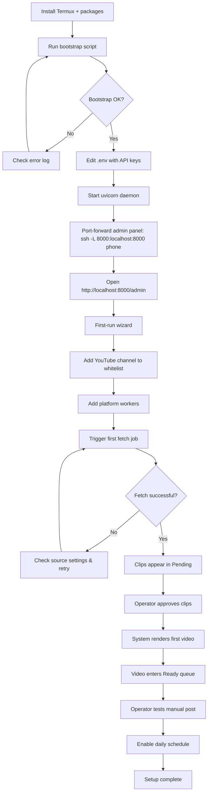
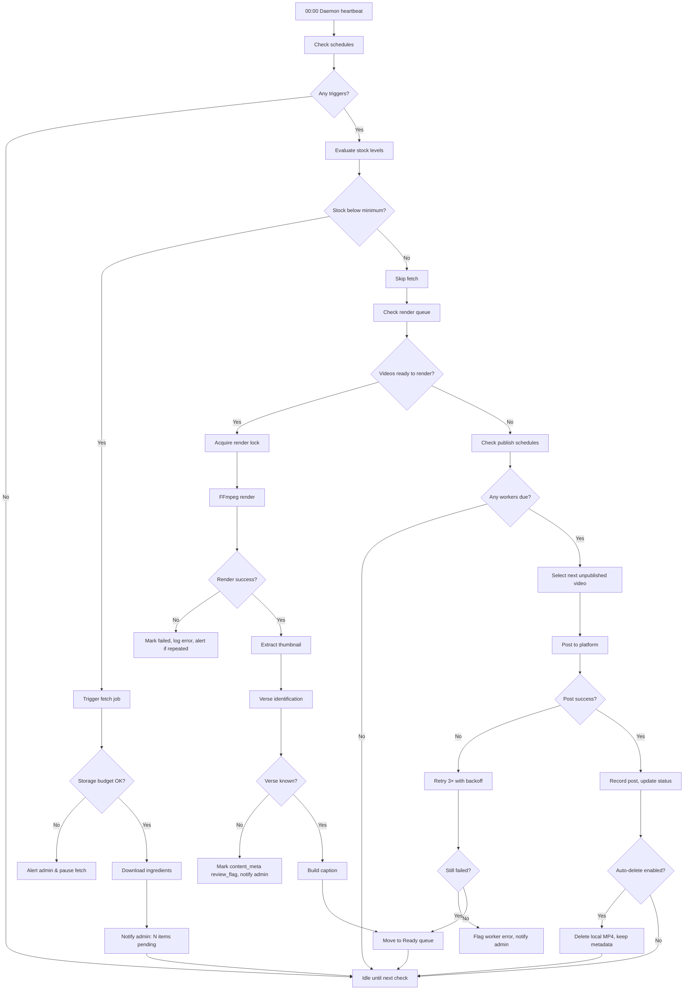
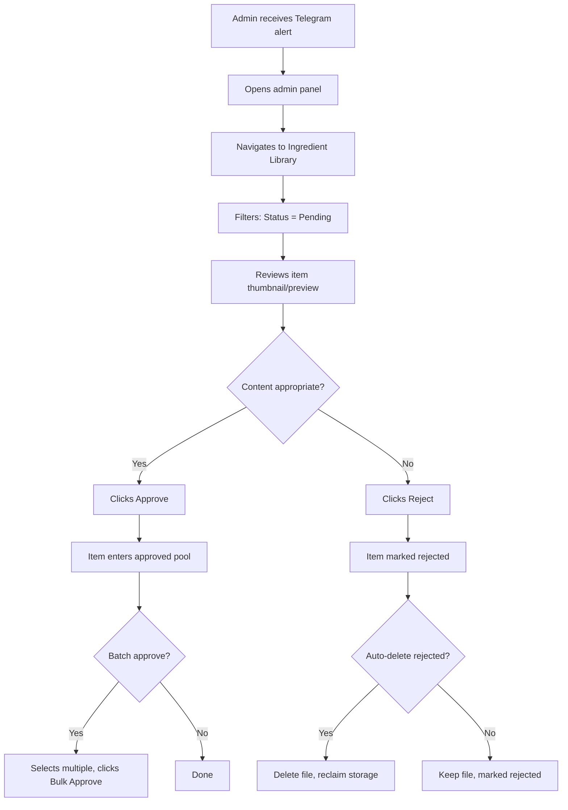
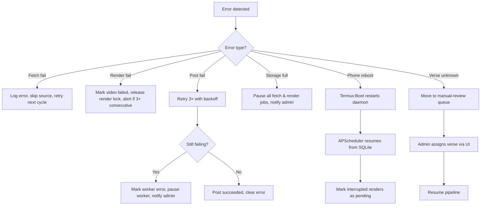
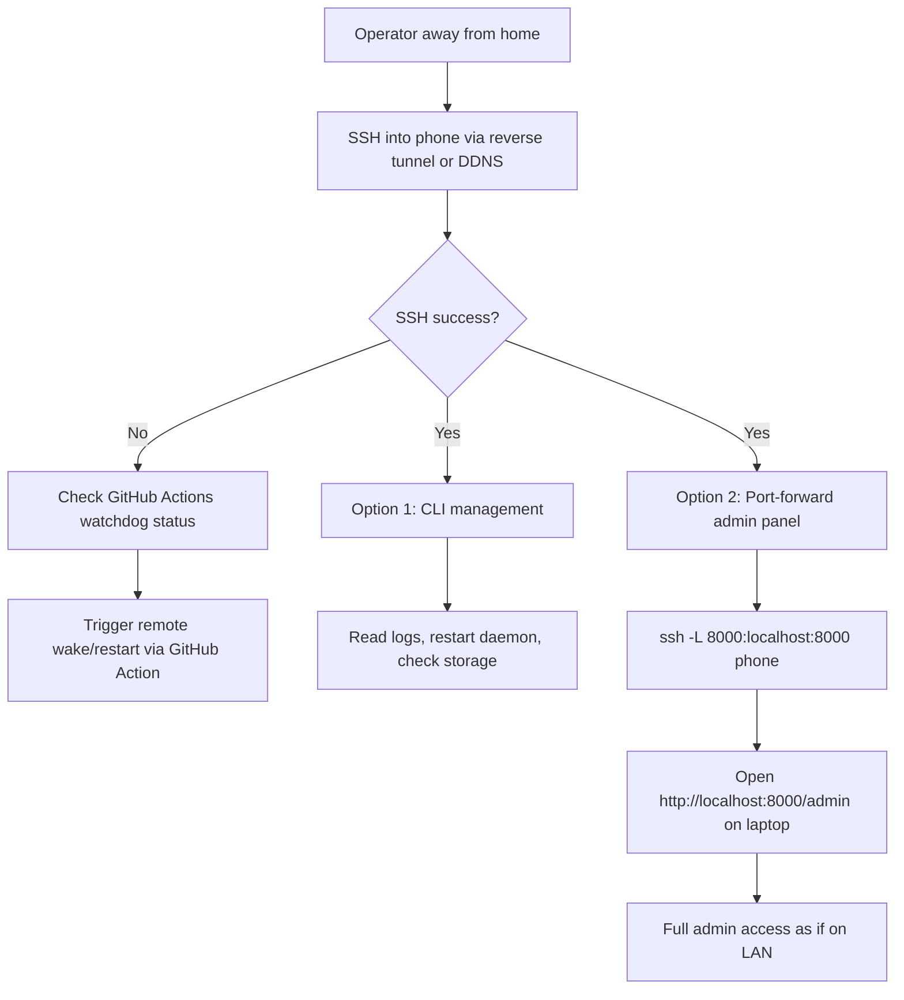

# Flux — User Flow Diagrams (Logic Flows)

All flows are described in **Mermaid diagram syntax** and plain-English walkthroughs. These represent the "hallways" between the "rooms" defined in the Information Architecture.

---

## 1. First-Time Setup Flow

The operator installs Flux on Termux and gets the first pipeline running.



**Key Decision Nodes:**
- Bootstrap OK? → Environment detection (Python version, FFmpeg, yt-dlp).
- Fetch successful? → Source validation (channel public? API key valid?).

---

## 2. Daily Autonomous Run Flow

The system runs without operator interaction for a typical 24-hour cycle.



**Idempotency Guards:**
- Render lock: only one FFmpeg process at a time.
- Post uniqueness: `(produced_content_id, worker_id)` unique constraint prevents duplicates.
- Schedule evaluation: APScheduler persists jobs in SQLite; resumes after reboot.

---

## 3. Admin Approval Flow

Operator reviews pending ingredients.



---

## 4. Adding a Platform Worker Flow

Operator connects a new social media account.

```mermaid
flowchart TD
    A[Admin opens Workers page] --> B[Clicks Add Worker]
    B --> C[Selects platform: YouTube / Telegram / Instagram / TikTok / X]
    C --> D{Platform?}
    D -->|YouTube| E[Upload OAuth client_secret.json]
    E --> F[Browser opens for OAuth consent]
    F --> G[Tokens stored encrypted]
    D -->|Telegram| H[Enter bot token + channel ID]
    H --> I[Test post to channel]
    D -->|Instagram| J[Enter username/password or session JSON]
    J --> K[System validates login via Instagrapi]
    D -->|TikTok / X| L[Enter session cookies or API keys]
    L --> M[Test login via API or manual session import]
    G --> N[Configure schedule]
    I --> N
    K --> N
    M --> N
    N --> O[Optional: caption override & hashtags]
    O --> P[Associate with pipeline(s)]
    P --> Q[Worker active]
```

---

## 5. Future Pipeline Creation Flow

Adding a new content type (e.g., "Daily Hadith") after Quran is stable.

```mermaid
flowchart TD
    A[Operator decides new content type] --> B[Writes or downloads plugin]
    B --> C[Places plugin in ./plugins/{name}/]
    C --> D[Restarts daemon]
    D --> E{Plugin valid?}
    E -->|No| F[Read validation errors in logs]
    F --> B
    E -->|Yes| G[Plugin appears in Plugin Manager]
    G --> H[Enable plugin]
    H --> I[Create new Pipeline]
    I --> J[Select plugin: Hadith]
    J --> K[Configure plugin-specific sources]
    K --> L[Assign platform workers]
    L --> M[Set schedule]
    M --> N[Pipeline runs first cycle]
```

**Plugin Validation Checks:**
- `plugin.yaml` manifest present and schema-valid.
- Required hooks implemented: `fetch()`, `render()`, `build_caption()`.
- API version compatibility.
- No filename collisions with core.

---

## 6. Error Recovery Flow

What happens when things go wrong.



---

## 7. Remote SSH Management Flow

Operator accesses the system remotely.



**Security note:** SSH is key-based only. Admin panel remains bound to localhost during remote access; port-forwarding is the secure tunnel.
